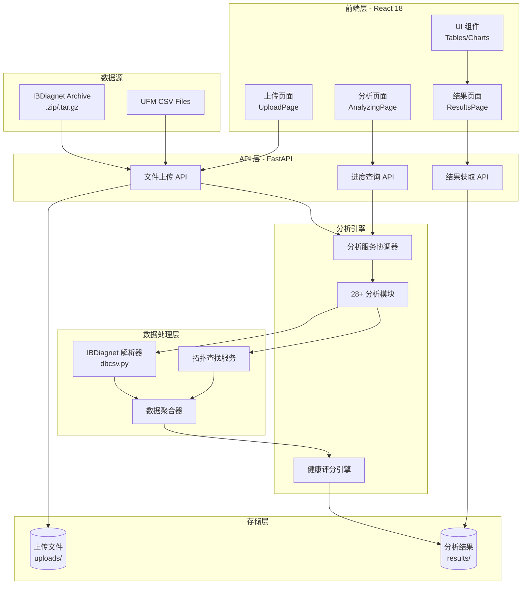
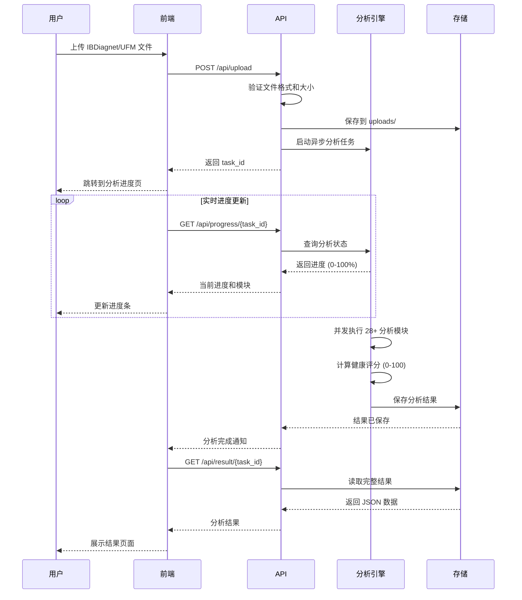

# NVIDIA Network Health Check Platform

<div align="center">


一个专业的 InfiniBand 网络健康检查与诊断分析平台

**📊 28+ 分析模块 | 🎯 智能评分 | 🚀 实时分析 | 📈 可视化报告**

[功能特性](#功能特性) • [快速开始](#快速开始) • [使用指南](#使用指南) • [开发文档](#开发文档)

---

### 📈 项目亮点

<table>
<tr>
<td align="center">
<b>🎯 智能评分</b><br/>
<font size="5">0-100</font><br/>
多维度健康评分
</td>
<td align="center">
<b>📊 分析维度</b><br/>
<font size="5">28+</font><br/>
全方位检查模块
</td>
<td align="center">
<b>⚡ 高性能</b><br/>
<font size="5">8x</font><br/>
并发处理能力
</td>
<td align="center">
<b>📦 数据支持</b><br/>
<font size="5">500MB</font><br/>
最大文件大小
</td>
</tr>
</table>

</div>

---

## 📋 目录

- [项目简介](#项目简介)
- [功能特性](#功能特性)
- [技术栈](#技术栈)
- [系统要求](#系统要求)
- [快速开始](#快速开始)
- [使用指南](#使用指南)
- [项目结构](#项目结构)
- [API 文档](#api-文档)
- [开发指南](#开发指南)
- [故障排查](#故障排查)
- [常见问题](#常见问题)
- [贡献指南](#贡献指南)
- [许可证](#许可证)

---

## 🎯 项目简介

NVIDIA Network Health Check Platform 是一个全面的 InfiniBand 网络诊断分析工具，专门用于分析 NVIDIA UFM 和 ibdiagnet 工具生成的网络诊断数据。

该平台提供：
- 🎯 **0-100 健康评分系统**：基于多维度指标的综合网络健康评估
- 📊 **30+ 维度分析模块**：涵盖链路、拥塞、误码、路由、性能等全方位分析
- 🚀 **实时流式处理**：支持大规模数据集的高效处理
- 📈 **智能异常检测**：自动识别网络问题并提供优化建议
- 🔍 **交互式数据探索**：强大的搜索、过滤和导出功能

---

## 🏗️ 系统架构



## 📊 数据流程



---

## ✨ 功能特性

### 核心分析模块

#### 🔌 连线与链路
- **Cable 跳线分析**：DOM 温度、光功率与合规性告警
- **Link Oscillation**：链路震荡和不稳定性检测

#### 📉 拥塞与性能
- **Xmit 拥塞分析**：FECN/BECN、Wait Ratio、拥塞等级
- **Per-Lane 性能**：按 Lane 统计的误码和降速分析

#### 🛡️ 误码监控
- **BER 分析**：Symbol/Effective/Raw 误码率检测
- **PHY Diagnostics**：物理层诊断与误码轨迹

#### 🖥️ 节点与固件
- **HCA/Firmware**：驱动/固件级别、MTUSB 错误
- **System Info**：系统级别信息及异常摘要
- **SM Info**：子网管理器状态和警告

#### 🌡️ 传感器监控
- **Fans**：风扇转速与告警
- **Power Sensors**：节点功耗和传感器异常
- **Temp Alerts**：温度阈值配置与告警

#### 🔀 路由与拓扑
- **Routing**：路由异常和不可达路径
- **Routing Config**：HBF/PFRN 配置对比
- **Port Hierarchy**：分层拓扑与关键节点

#### 📊 性能计数器
- **MLNX Counters**：Mellanox 性能计数器异常
- **PM Delta**：PM 周期性差异与异常激增
- **PCIe Performance**：主机 PCIe 带宽/退化情况

#### 🔐 QoS 与安全
- **QoS**：QoS 配置与违规
- **N2N Security**：N2N 能力覆盖率与违规
- **PKEY**：PKEY 配置与冲突
- **VPorts**：虚拟端口与多租户配置

#### ⚙️ Fabric 配置
- **Adaptive Routing**：AR 配置与异常
- **SHARP**：SHARP 会话与节点支持
- **FEC Mode**：链路 FEC 模式与不匹配

#### 🔬 诊断扩展
- **Extended Port/Node/Switch Info**：扩展信息与异常属性
- **Buffer Histogram**：缓冲区利用率分析
- **Neighbors**：邻居和拓扑邻接异常

### 其他功能

- ✅ **多数据源支持**：ibdiagnet 归档（.zip/.tar.gz）、UFM CSV 文件
- 📝 **智能报告**：自动生成问题摘要和优化建议
- 🎨 **现代化 UI**：响应式设计，支持深色/浅色主题
- 📤 **数据导出**：支持导出分析结果为 CSV/JSON
- 🔄 **历史记录**：保存和查看历史分析结果
- 🚀 **高性能处理**：支持并发分析，智能限流

---

## 🛠️ 技术栈

### 后端
- **Python 3.11+**
- **FastAPI**：高性能 Web 框架
- **Pandas**：数据分析和处理
- **asyncio**：异步处理支持

### 前端
- **React 18+**：用户界面构建
- **Vite**：现代化构建工具
- **TailwindCSS**：样式框架
- **Lucide Icons**：图标库

### 其他
- **Docker**：容器化支持（可选）
- **Git**：版本控制

---

## 💻 系统要求

### 最低要求
- **操作系统**：Windows 10/11, macOS 10.15+, Linux (Ubuntu 20.04+)
- **Python**：3.11 或更高版本
- **Node.js**：18.0 或更高版本
- **内存**：4GB RAM
- **存储**：1GB 可用空间

### 推荐配置
- **内存**：8GB+ RAM
- **处理器**：4 核心或更多
- **存储**：5GB+ 可用空间（用于存储分析结果）

---

## 🚀 快速开始

### 1. 克隆项目

```bash
git clone https://github.com/zhangdailin/NVIDIA_NETWORK_HEALTH_CHECK_PLATFORM.git
cd nvidia-network-health-check
```

### 2. 安装依赖

#### 后端依赖

```bash
cd backend
pip install -r requirements.txt
```

#### 前端依赖

```bash
cd frontend
npm install
```

### 3. 运行项目

#### 方式一：开发模式（推荐）

同时启动前端和后端开发服务器：

```bash
# 在项目根目录
npm run dev
```

- 前端：http://localhost:5173
- 后端 API：http://localhost:8000
- API 文档：http://localhost:8000/docs

#### 方式二：生产模式

```bash
# 构建前端
npm run build

# 启动后端服务器（会自动提供前端静态文件）
npm run server
```

访问：http://localhost:8000

### 4. 上传数据进行分析

1. 准备 ibdiagnet 归档文件（.zip 或 .tar.gz）或 UFM CSV 文件
2. 在 Web 界面上传文件
3. 等待分析完成
4. 查看详细分析结果

---

## 📖 使用指南

### 数据准备

#### ibdiagnet 数据采集

```bash
# 基础采集
ibdiagnet

# 启用扩展性能采集（推荐）
ibdiagnet --performance_histogram --extended_info

# 打包结果
cd /var/tmp/ibdiagnet2
tar -czf ibdiagnet_$(date +%Y%m%d_%H%M%S).tar.gz *
```

#### UFM CSV 导出

通过 UFM REST API 导出 CSV 数据：

```bash
# 示例：导出端口信息
curl -k -u admin:password "https://ufm-server/ufm/resources/ports" \
  -H "Accept: text/csv" -o ports.csv
```

### 分析流程

1. **上传数据**
   - 支持拖拽上传或点击选择文件
   - 文件大小限制：500MB
   - 支持格式：.zip, .tar.gz, .tgz, .csv

2. **自动分析**
   - 系统自动解压和解析数据
   - 并行执行 30+ 个分析模块
   - 实时显示分析进度

3. **查看结果**
   - **总览页**：健康评分和关键问题摘要
   - **详细页**：按模块查看具体问题
   - **数据表**：支持搜索、过滤、排序、导出

4. **导出报告**
   - CSV 格式：适用于 Excel 分析
   - JSON 格式：适用于程序化处理

---

## 📁 项目结构

```
NVIDIA_NETWORK_HEALTH_CHECK_PLATFORM/
├── backend/                    # 后端代码
│   ├── api.py                 # API 路由定义
│   ├── main.py                # FastAPI 应用入口
│   ├── services/              # 分析服务
│   │   ├── analysis_service.py      # 分析服务协调器
│   │   ├── ber_service.py           # BER 分析
│   │   ├── cable_service.py         # 线缆分析
│   │   ├── histogram_service.py     # 延迟分析
│   │   ├── switch_service.py        # 交换机分析
│   │   ├── routing_service.py       # 路由分析
│   │   ├── health_score.py          # 健康评分
│   │   └── ...                      # 其他分析服务
│   ├── config/                # 配置文件
│   ├── uploads/               # 上传文件存储
│   ├── results/               # 分析结果缓存
│   └── requirements.txt       # Python 依赖
│
├── frontend/                   # 前端代码
│   ├── src/
│   │   ├── pages/             # 页面组件
│   │   │   ├── UploadPage.jsx      # 上传页面
│   │   │   ├── AnalyzingPage.jsx   # 分析进度页
│   │   │   └── ResultsPage.jsx     # 结果展示页
│   │   ├── components/        # 通用组件
│   │   │   ├── ModernOverview.jsx  # 总览组件
│   │   │   ├── VirtualTable.jsx    # 虚拟化表格
│   │   │   └── ThemeToggle.jsx     # 主题切换
│   │   ├── constants/         # 常量定义
│   │   │   └── tabs.js             # 标签页配置
│   │   ├── healthCheckDefinitions.js  # 健康检查定义
│   │   ├── App.jsx            # 应用入口
│   │   └── index.css          # 全局样式
│   ├── public/                # 静态资源
│   └── package.json           # Node.js 依赖
│
├── doc/                       # 文档
├── scripts/                   # 工具脚本
├── package.json               # 项目配置
├── build.js                   # 构建脚本
└── README.md                  # 本文件
```

---

## 📡 API 文档

### 核心 API

#### 上传并分析文件

```http
POST /api/upload
Content-Type: multipart/form-data

Parameters:
  - file: File (ibdiagnet archive or UFM CSV)

Response:
{
  "task_id": "uuid",
  "message": "分析已开始"
}
```

#### 查询分析进度

```http
GET /api/progress/{task_id}

Response:
{
  "stage": "analyzing",
  "progress": 75,
  "message": "已完成 BER 分析",
  "current_service": "ber"
}
```

#### 获取分析结果

```http
GET /api/result/{task_id}

Response:
{
  "health": {
    "score": 85,
    "grade": "良好",
    "severity": "warning"
  },
  "cable_data": [...],
  "ber_data": [...],
  ...
}
```

#### 查看历史记录

```http
GET /api/history

Response:
{
  "analyses": [
    {
      "task_id": "uuid",
      "timestamp": "2026-01-27T08:10:29Z",
      "score": 85,
      "issues_count": 12
    },
    ...
  ]
}
```

完整 API 文档：http://localhost:8000/docs

---

## 🔧 开发指南

### 环境配置

#### 后端开发

```bash
# 创建虚拟环境
python -m venv venv

# 激活虚拟环境
# Windows
venv\Scripts\activate
# macOS/Linux
source venv/bin/activate

# 安装开发依赖
pip install -r requirements.txt
pip install pytest pytest-cov black flake8
```

#### 前端开发

```bash
cd frontend
npm install
npm run dev
```

### 代码规范

#### Python 代码风格

```bash
# 格式化代码
black backend/

# 代码检查
flake8 backend/

# 类型检查
mypy backend/
```

#### JavaScript 代码风格

```bash
# 格式化代码
npm run format

# 代码检查
npm run lint
```

### 运行测试

```bash
# 后端测试
cd backend
pytest

# 前端测试
cd frontend
npm test
```

### 添加新的分析模块

1. **创建服务类**：`backend/services/new_service.py`

```python
from dataclasses import dataclass, field
from pathlib import Path
from typing import Dict, List

@dataclass
class NewAnalysisResult:
    data: List[Dict[str, object]] = field(default_factory=list)
    summary: Dict[str, object] = field(default_factory=dict)

class NewService:
    def __init__(self, dataset_root: Path):
        self.dataset_root = dataset_root

    def run(self) -> NewAnalysisResult:
        # 实现分析逻辑
        return NewAnalysisResult()
```

2. **注册到分析服务**：`backend/services/analysis_service.py`

```python
from .new_service import NewService

# 在 service_specs 中添加
("new_module", "Running new analysis...", self._run_new_service)

def _run_new_service(self, target_dir: Path):
    service = NewService(dataset_root=target_dir)
    return service.run()
```

3. **添加前端配置**：`frontend/src/healthCheckDefinitions.js`

```javascript
new_module: {
  key: 'new_module',
  label: '新模块',
  group: 'diagnostics',
  dataKey: 'new_module_issue_rows',
  totalKey: 'new_module_total_rows',
  summaryKey: 'new_module_summary',
  description: '新模块描述',
}
```

4. **创建前端组件**：`frontend/src/NewModuleAnalysis.jsx`

```jsx
function NewModuleAnalysis({ data, summary, totalRows }) {
  return (
    <UnifiedAnalysisPage
      title="新模块"
      description="新模块描述"
      data={data}
      summary={summary}
      totalRows={totalRows}
      // ...
    />
  )
}
```

---

## 🐛 故障排查

### 常见问题

#### 问题 1：分析结果为空

**症状**：某些分析模块（如 Latency、Switches）显示为空

**原因**：
- ibdiagnet 数据源缺少相应的表
- 采集时未启用相关功能
- 设备不支持该功能

**解决方案**：

1. 运行诊断脚本检查数据：
```bash
cd backend
python check_latency_data.py uploads/extracted_xxx/ibdiagnet2.db_csv
```

2. 重新采集数据并启用所有功能：
```bash
ibdiagnet --performance_histogram --extended_info
```

3. 如果设备不支持，可以在前端配置中禁用该模块

#### 问题 2：上传失败

**症状**：文件上传时出现错误

**可能原因**：
- 文件过大（>500MB）
- 文件格式不支持
- 磁盘空间不足
- 权限问题

**解决方案**：
- 检查文件大小和格式
- 确保 `uploads/` 目录有写权限
- 检查磁盘空间
- 查看后端日志：`tail -f backend.log`

#### 问题 3：性能问题

**症状**：分析速度慢或前端卡顿

**优化方法**：

1. 调整并发数：
```bash
# 设置环境变量
export ANALYSIS_MAX_CONCURRENCY=8
export ANALYSIS_MAX_WORKERS=8
```

2. 启用数据限制：
```bash
export ADAPTIVE_LIMIT_ENABLED=true
export ADAPTIVE_LIMIT_MAX_ROWS=1000
```

3. 减少预览行数：
```python
# backend/services/analysis_service.py
MAX_PREVIEW_ROWS = 500
```

#### 问题 4：端口冲突

**症状**：服务启动失败，提示端口被占用

**解决方案**：

1. 修改端口配置：
```bash
# 后端端口
export PORT=8001

# 前端开发服务器端口
# 修改 frontend/vite.config.js
server: {
  port: 5174
}
```

2. 或者关闭占用端口的进程

### 日志查看

```bash
# 后端日志
tail -f backend/logs/app.log

# 前端开发日志
# 在浏览器控制台查看
```

---

## ❓ 常见问题 (FAQ)

### Q1: 支持哪些数据格式？

A: 支持以下格式：
- ibdiagnet 归档：`.zip`, `.tar.gz`, `.tgz`
- UFM CSV 文件：`.csv`

### Q2: 最大支持多大的文件？

A: 默认限制为 500MB。可通过修改 `backend/api.py` 中的 `MAX_FILE_SIZE` 调整。

### Q3: 分析结果保存多久？

A: 默认保存 24 小时。可通过 `MAX_UPLOAD_AGE_HOURS` 环境变量调整。

### Q4: 可以同时分析多个文件吗？

A: 可以。系统支持并发分析，但建议根据服务器性能适当控制并发数。

### Q5: 如何导出完整数据？

A: 在数据表中点击"导出"按钮，选择 CSV 或 JSON 格式。注意：导出可能受到行数限制。

### Q6: 健康评分是如何计算的？

A: 健康评分基于多个维度的问题数量、严重程度和权重计算。详见 `backend/services/health_score.py`。

---

## 🤝 贡献指南

我们欢迎各种形式的贡献！

### 贡献方式

1. **报告问题**：在 Issues 中提交 Bug 报告或功能请求
2. **提交代码**：Fork 项目并提交 Pull Request
3. **改进文档**：完善文档和示例
4. **分享经验**：分享使用经验和最佳实践

### Pull Request 流程

1. Fork 本仓库
2. 创建功能分支：`git checkout -b feature/amazing-feature`
3. 提交更改：`git commit -m 'Add some amazing feature'`
4. 推送到分支：`git push origin feature/amazing-feature`
5. 创建 Pull Request

### 代码审查标准

- ✅ 遵循项目代码风格
- ✅ 包含必要的测试
- ✅ 更新相关文档
- ✅ 通过所有 CI 检查
- ✅ 添加 Co-Authored-By 署名：`Co-Authored-By: Warp <agent@warp.dev>`

---

## 📄 许可证

本项目采用 MIT 许可证 - 详见 [LICENSE](LICENSE) 文件

---

## 🙏 致谢

- NVIDIA 提供的 UFM 和 ibdiagnet 工具
- FastAPI 和 React 社区
- 所有贡献者和用户

---

## 📞 联系方式

- **Issues**：https://github.com/your-org/nvidia-network-health-check/issues
- **Email**：support@your-org.com
- **Documentation**：https://docs.your-org.com

---

## 🗺️ 路线图

### 近期计划 (v1.1)
- [ ] 添加拓扑可视化功能
- [ ] 支持多语言界面
- [ ] 增加趋势分析功能
- [ ] 优化大数据集处理性能

### 中期计划 (v2.0)
- [ ] 实时监控功能
- [ ] 告警通知系统
- [ ] 多租户支持
- [ ] RESTful API 扩展

### 长期计划 (v3.0)
- [ ] AI 驱动的故障预测
- [ ] 自动化修复建议
- [ ] 集成更多网络设备
- [ ] 云原生部署支持

---

<div align="center">

⭐ Star us on GitHub — it helps!

[Back to top](#nvidia-network-health-check-platform)

</div>
